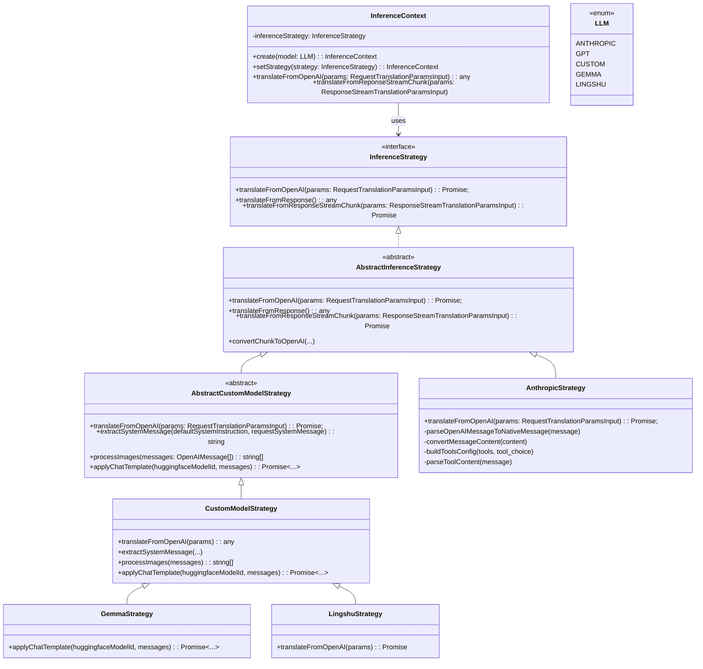

# LLM Rosetta

A TypeScript library that provides a universal translation layer for converting OpenAI API requests to different LLM providers, enabling seamless switching between various AI models with a consistent interface.

## 🚀 Features

- **Universal Translation**: Convert OpenAI API requests to Bedrock and custom Hugging Face models
- **Strategy Pattern**: Extensible architecture for adding new LLM providers
- **Type Safety**: Full TypeScript support with comprehensive type definitions
- **Tool Support**: Handles function calling and tool usage across providers
- **Multimodal Support**: Supports text and image inputs with proper format conversion
- **System Instructions**: Flexible system message handling and augmentation

## 📦 Installation

```bash
npm install llm-rosetta
```

## 🛠️ Usage

### Basic Usage

```typescript
import { InferenceContext, LLM } from 'llm-rosetta';

// Create inference context for Anthropic
const context = InferenceContext.create(LLM.ANTHROPIC);

// Translate OpenAI request to Anthropic format
const translatedRequest = context.translateFromOpenAI({
  requestBody: {
    model: 'gpt-4',
    messages: [
      { role: 'system', content: 'You are a helpful assistant.' },
      { role: 'user', content: 'Hello, world!' }
    ],
    stream: false,
    temperature: 0.7,
    max_tokens: 1000
  },
  systemInstruction: 'Additional system context'
});
```

### Using Custom Models (Hugging Face)

```typescript
import { InferenceContext, LLM } from 'llm-rosetta';

// Create context for custom model
const context = InferenceContext.create(LLM.CUSTOM);

// Translate to Hugging Face format
const translatedRequest = context.translateFromOpenAI({
  requestBody: {
    model: 'gpt-4',
    messages: [
      { role: 'user', content: 'Explain quantum computing' }
    ],
    stream: false
  },
  huggingfaceModelId: 'microsoft/DialoGPT-medium',
  systemInstruction: 'You are a helpful AI assistant.'
});
```

### Advanced Usage with Tools

```typescript
import { InferenceContext, LLM, ConversationRole } from 'llm-rosetta';

const context = InferenceContext.create(LLM.ANTHROPIC);

const request = context.translateFromOpenAI({
  requestBody: {
    model: 'gpt-4',
    messages: [
      { role: 'user', content: 'What is the weather like?' }
    ],
    tools: [
      {
        type: 'function',
        function: {
          name: 'get_weather',
          description: 'Get the current weather',
          parameters: {
            type: 'object',
            properties: {
              location: { type: 'string' }
            }
          }
        }
      }
    ],
    tool_choice: 'auto',
    stream: false
  }
});
```

## 🏗️ Architecture

The library uses the Strategy pattern to handle different LLM providers:

- **InferenceContext**: Main orchestrator that manages translation strategies
- **InferenceStrategy**: Interface for implementing provider-specific translations
- **AnthropicStrategy**: Converts OpenAI requests to Anthropic Bedrock format
- **CustomModelStrategy**: Converts OpenAI requests to Hugging Face format

### Class Structure




### Supported Providers

| Provider | Status | Features |
|----------|--------|----------|
| Anthropic Bedrock | ✅ | Full support including tools and multimodal |
| Hugging Face | ✅ | Text generation with chat templates and multimodal for all models available on Hugging Face |
| Lingshu | ✅ | Custom image processing for multimodal models with chat templates - no function calling (tool calling) supported |
| Google Gemma Family | 🚧 | In progress - currently supporting text generation with chat templates and multimodal - no function calling (tool calling) supported yet |
| Nova Bedrock | 🚧 | Planned (native support) |

## 🤝 Contributing

1. Fork the repository
2. Create a feature branch (`git checkout -b feature/amazing-feature`)
3. Commit your changes (`git commit -m 'Add some amazing feature'`)
4. Push to the branch (`git push origin feature/amazing-feature`)
5. Open a Pull Request

## 📄 License

This project is licensed under the MIT License - see the [LICENSE](LICENSE) file for details.

## 🙏 Acknowledgments

- Inspired by the need for LLM provider interoperability
- Built with TypeScript for type safety and developer experience
- Uses Hugging Face Transformers for custom model support
